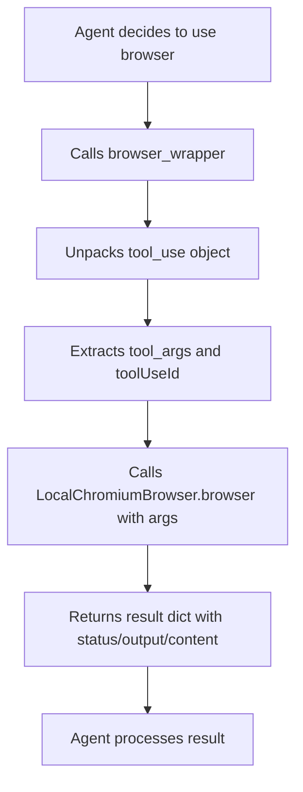

# Browser Tool - Technical Details

## Architecture

The Browser tool integration uses:
- **LocalChromiumBrowser** from `strands_tools.browser`
- **Playwright** for browser automation
- **PythonAgentTool** wrapper to integrate with Strands agent framework

## How It Works

### Tool Invocation Flow



### Wrapper Function

The `browser_wrapper` in `scouts.py` handles:
1. **Argument injection**: Ignores `agent` and `event_loop_cycle_id` args from Strands
2. **Input unpacking**: Extracts `input` from the `tool_use` object
3. **Result formatting**: Wraps results in `{status, output, content, toolUseId}` format

### Action Format

Browser actions are specified as:

```json
{
  "action": {
    "type": "action_name",
    ...parameters
  }
}
```

Available action types:
- `init_session`: Create a new browser session
- `navigate`: Go to a URL
- `click`: Click an element (requires `selector`)
- `get_text`: Extract text from element (requires `selector`)
- `get_html`: Get HTML content
- `evaluate`: Run JavaScript (requires `script`)
- `screenshot`: Take a screenshot

## Integration Points

### File: `src/influencerpy/core/scouts.py`

```python
# Lines 149-194
if "browser" in tools_config:
    browser = LocalChromiumBrowser()
    
    def browser_wrapper(browser_input, agent=None, event_loop_cycle_id=None, **kwargs):
        # Wrapper logic to handle Strands' argument injection
        ...
    
    agent_tools.append(PythonAgentTool(
        tool_name=browser.browser.tool_spec['name'],
        tool_spec=browser.browser.tool_spec,
        tool_func=browser_wrapper
    ))
```

### File: `src/influencerpy/main.py`

Browser tool selection in:
- Scout creation flow (line ~666)
- Scout update flow (line ~788)

## Debugging

### Viewing Browser Actions

Check scout logs to see which actions were called:

```bash
grep -E "(navigate|click|evaluate)" .influencerpy/logs/scouts/[ScoutName]/[timestamp].log
```

### Common Debug Patterns

**Agent uses basic actions only:**
```
tool_use={'action': {'type': 'init_session', ...}}
tool_use={'action': {'type': 'navigate', ...}}
tool_use={'action': {'type': 'get_text', 'selector': 'body'}}
```

**Agent successfully uses evaluate:**
```
tool_use={'action': {'type': 'evaluate', 'script': '...'}}
```

**Agent clicks on element:**
```
tool_use={'action': {'type': 'click', 'selector': '...'}}
```

## Testing

Run verification script:
```bash
python3 test_huggingface_papers.py
```

Expected behavior:
- ✅ Navigate to URL
- ✅ Extract text content
- ❌ Click on links (currently broken)
- ❌ Use evaluate for JS (currently broken)
