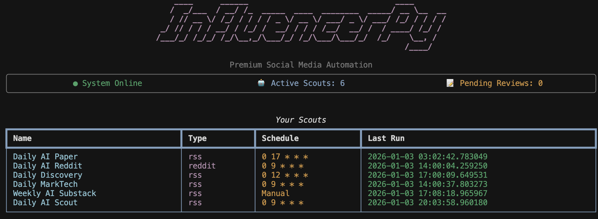

# Welcome to InfluencerPy

**Intelligent Content Discovery & Curation, Powered by AI**

InfluencerPy is an AI-powered tool that helps you discover, monitor, and curate the best content from across the web. Using intelligent scouts, it continuously finds relevant content, summarizes key insights, and optionally generates social media posts.

## Key Features

- **🔍 Smart Content Discovery**: Create AI scouts that monitor RSS, Reddit, Substack, Arxiv, and more
- **📋 Curated Reports**: Get organized lists with summaries and links to original sources
- **🤖 AI-Powered**: Uses Gemini or Anthropic for intelligent content selection and summarization
- **✍️ Optional Post Generation**: Turn discovered content into social media posts for X (Twitter)
- **📱 Telegram Delivery**: Receive scout reports and review drafts from your phone
- **📅 Smart Scheduling**: Set scouts to run automatically (daily, weekly, custom)
- **🧠 Self-Improving**: Learns from your feedback to optimize content selection



## Two Modes of Operation

### 🔍 Scouting Mode (Primary)
Find and list interesting content with summaries and links. Perfect for:

- Research and staying informed in your field
- Competitive intelligence
- Newsletter curation
- Content discovery for teams

### ✍️ Generation Mode (Optional)
Automatically create social media posts from discovered content. Great for:

- Maintaining active social presence
- Content repurposing
- Automated Twitter accounts

## Quick Start

```bash
git clone https://github.com/cristianleoo/InfluencerPy.git
cd InfluencerPy
pip install -e .
influencerpy
```

## Examples & Tutorials

Check out practical examples and step-by-step tutorials to get started quickly:

### 📚 Complete Tutorials

**[Multi-Feed RSS Scout Example](../examples/multi_rss_scout_example.md)**

Comprehensive guide for creating a content discovery scout that monitors multiple RSS feeds simultaneously. Learn how to:

- Add multiple RSS feeds in one scout (comma-separated)
- Monitor 5+ sources with a single daily digest  
- Understand multi-feed behavior and AI selection
- Customize and troubleshoot your scout

**Real-world use case:** AI Research Digest monitoring Berkeley, Google, MIT, Microsoft, and Takara AI feeds.

---

**[Multi-Feed RSS Visual Guide](../examples/multi_rss_visual_guide.md)**

Step-by-step walkthrough with command-line examples showing exactly what you'll see when creating and running a multi-feed scout. Perfect for visual learners!

### 🛠️ Code Examples

**[HTTP Tool Demo](../examples/http_tool_demo.py)**

Demonstrates web scraping and content extraction using the HTTP Request tool:

```python
from influencerpy.tools.http_tool import http_request

# Fetch a webpage
result = http_request(url="https://example.com")
print(f"Title: {result['title']}")
print(f"Content: {result['content'][:200]}...")

# Extract specific content with CSS selectors
result = http_request(
    url="https://en.wikipedia.org/wiki/Web_scraping",
    selector="#mw-content-text"
)

# Extract all links from a page
result = http_request(
    url="https://news.ycombinator.com",
    extract_links=True
)
for link in result['links'][:5]:
    print(f"{link['text']}: {link['url']}")
```

**Run the full demo:**

```bash
python examples/http_tool_demo.py
```

**Features demonstrated:**

- Basic URL fetching and parsing
- CSS selector usage for targeted content
- Link extraction from pages
- Error handling

### 🚀 Quick Start Example

Here's a quick example of creating a scout to monitor AI research from multiple sources:

```
# Run influencerpy and choose "Create Scout"
# Then configure:

Scout Name: AI Research Digest
Intent: 🔍 Content Discovery (Scouting)
Scout Type: 📡 RSS
RSS Feed URLs: https://tldr.takara.ai/api/papers, https://bair.berkeley.edu/blog/feed.xml, https://research.google/blog/rss/, https://news.mit.edu/rss/topic/artificial-intelligence2, https://news.microsoft.com/source/topics/ai/feed/
Schedule: Daily at 9:00 AM
```

**Tip**: You can add multiple RSS feeds at once by separating them with commas! This example monitors 5 different AI research sources.

The scout will:

1. Monitor 5 AI research feeds simultaneously (Berkeley, Google, MIT, Microsoft, Takara)
2. Use AI to analyze and select the most relevant articles across all sources
3. Send a curated list to your Telegram with summaries and links
4. Run automatically every day at 9 AM

**📖 For detailed step-by-step instructions, see the [Multi-Feed RSS Scout Example](../examples/multi_rss_scout_example.md).**

---

**More Examples:** Check out the [examples directory](../examples/) for additional tutorials and code samples.

## Documentation

*   [Getting Started](getting-started.md): Installation and initial setup
*   [Understanding Scouts](concepts/scouts.md): Learn about scouting vs generation intents
*   [Telegram Integration](channels/telegram.md): Setup Telegram for scout reports
*   [Scheduling](concepts/scheduling.md): Automate your content pipeline
